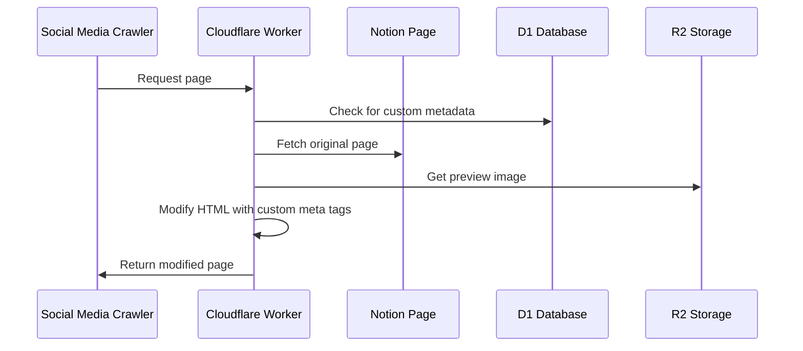
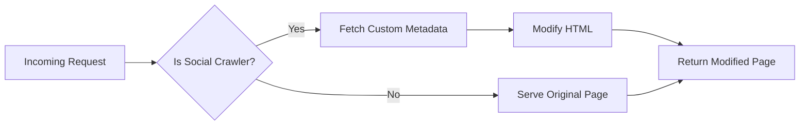
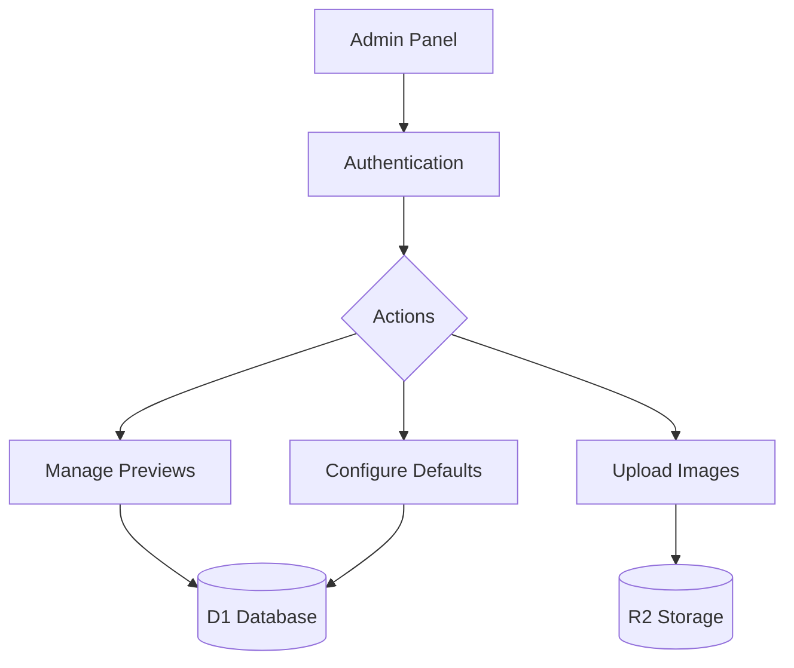
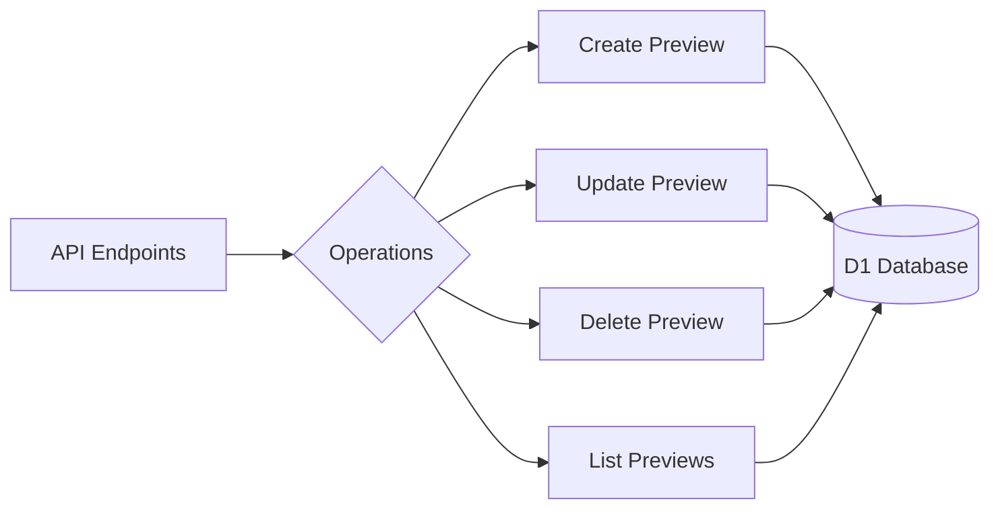
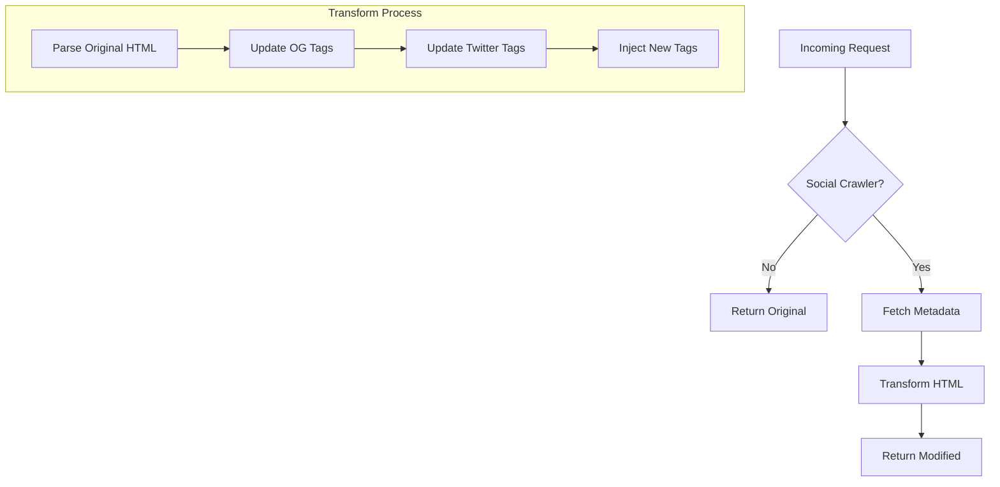
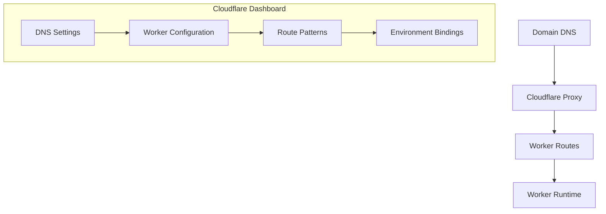
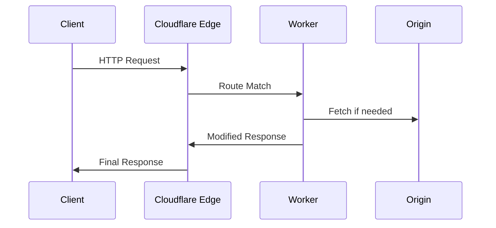
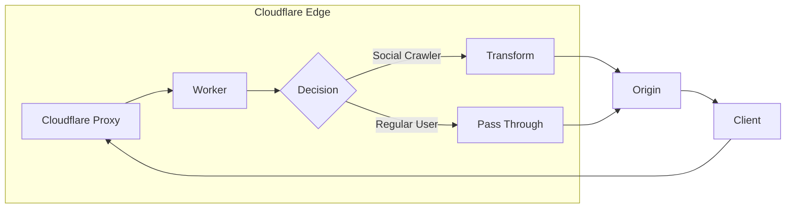
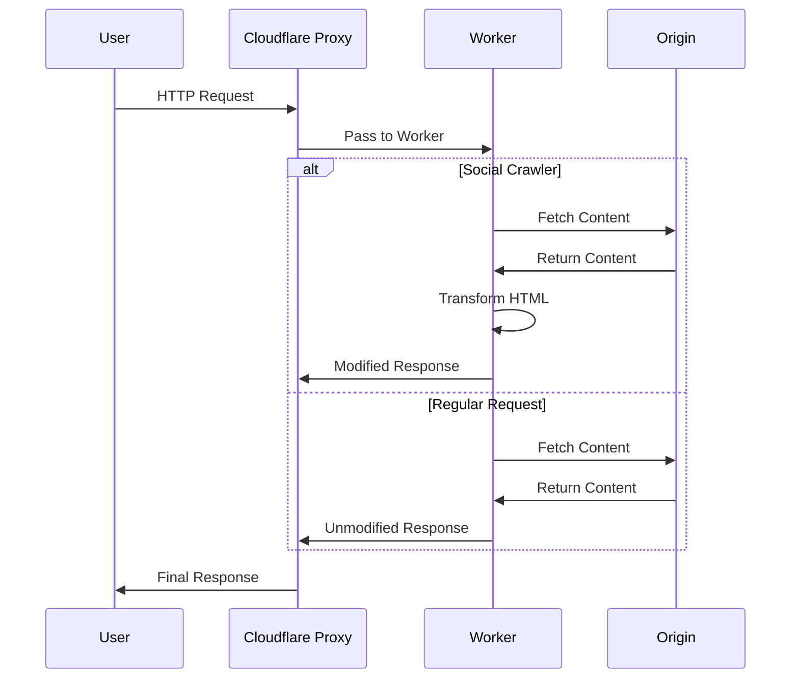

# `sharecraft`

A Cloudflare Worker that customizes social media preview cards for Notion pages. This worker intercepts requests from social media crawlers and serves custom meta tags for better social sharing previews.

## See also

[PLAN.md](PLAN.md) - imminent plans and things I don't want to forget. A .plan file by another name.

## Table of Contents

1. [Introduction & Features](#introduction--features)
2. [Getting Started](#getting-started)
3. [Architecture & Implementation Details](#architecture--implementation-details)
4. [Administration & Usage](#administration--usage)
5. [Technical Documentation](#technical-documentation)
6. [Troubleshooting & Maintenance](#troubleshooting--maintenance)
7. [Advanced Configuration](#advanced-configuration)
8. [Reference](#reference)

## Introduction & Features

### Core Features

- Custom social preview metadata for specific pages
- Default fallback previews
- Admin panel for managing previews
- Support for multiple social platforms (X, Facebook, LinkedIn, etc.)
- Image upload and management
- Secure authentication
- Detects social media crawlers
- Modifies HTML responses to include custom metadata
- Serves images from R2
- Provides an admin interface

### Key Benefits

- **Customized Social Sharing**: Full control over how your content appears when shared on social platforms
- **Easy Management**: User-friendly admin interface for non-technical users
- **Optimized Performance**: Leverages Cloudflare's edge network with proper caching
- **Cost-Effective**: Uses Cloudflare's generous free tier for most small to medium blogs

### Storage Solutions

- **D1 Database**: Stores your custom social preview metadata
- **R2 Bucket**: Hosts your preview images
- **KV Namespace**: Manages configuration and admin authentication

## Getting Started

### Prerequisites

This solution uses:

- **Cloudflare Workers**: To intercept requests and modify HTML responses
- **Cloudflare D1**: SQL database to store custom preview metadata
- **Cloudflare R2**: Object storage for preview images
- **Cloudflare KV**: To store configuration and session data

### Setup Instructions

#### 1. Set Up Cloudflare Resources

First, install the Wrangler CLI:

```bash
npm install
```

Then login to your Cloudflare account:

```bash
npx wrangler login
```

##### Create D1 Database

```bash
npx wrangler d1 create social_previews
```

Take note of the database ID from the output.

##### Create R2 Bucket

```bash
npx wrangler r2 bucket create preview-images
```

##### Create KV Namespace

```bash
npx wrangler kv:namespace create CONFIG
```

Take note of the namespace ID from the output.

#### 2. Configure wrangler.toml

Create a `wrangler.toml` file in your project root:

```toml
name = "notion-social-preview"
main = "src/index.js"
compatibility_date = "2023-05-01"

[[d1_databases]]
binding = "DB"
database_name = "social_previews"
database_id = "YOUR_DATABASE_ID_HERE"

[[r2_buckets]]
binding = "PREVIEW_IMAGES"
bucket_name = "preview-images"

[[kv_namespaces]]
binding = "CONFIG"
id = "YOUR_KV_NAMESPACE_ID_HERE"

# Routes
[routes]
pattern = "yourdomain.com/*"
zone_name = "yourdomain.com"
```

Replace the placeholders with your actual database ID, KV namespace ID, and domain name.

#### 3. Initialize the Database

Create a `migrations` directory and save the SQL migration script there:

```bash
mkdir migrations
```

Put the D1 migration script in `migrations/init.sql`.

Run the migration:

```bash
npx wrangler d1 execute social_previews --file=./migrations/init.sql
```

The following SQL schema will be used:

```sql
CREATE TABLE social_previews (
  id INTEGER PRIMARY KEY AUTOINCREMENT,
  path TEXT NOT NULL,
  title TEXT NOT NULL,
  description TEXT NOT NULL,
  image_url TEXT NOT NULL,
  is_default INTEGER DEFAULT 0
);
```

#### 4. Set Up KV Values

Generate a random password. You can use this script or generate your own.

JavaScript version:

```javascript
function generateSecurePassword(length = 32) {
  const charset = "abcdefghijklmnopqrstuvwxyzABCDEFGHIJKLMNOPQRSTUVWXYZ0123456789";
  let password = "";
  for (let i = 0; i < length; i++) {
    const randomIndex = Math.floor(Math.random() * charset.length);
    password += charset[randomIndex];
  }
  return password;
}
console.log(generateSecurePassword(32));
```

Shell oneliner using [`**oven-sh/bun**`](https://github.com/oven-sh/bun) - you can use `node -e` if you're boring:

```sh
bun -e "const g=n=>[...Array(n)].map(_=>('0z\$'[Math.random()*3|0]+String.fromCharCode(48+Math.random()*75|0)).slice(-1)).join('');console.log(g(32))"
```

Set the admin username:

```sh
npx wrangler kv:key put --binding=CONFIG "admin_username" "admin" --namespace-id=YOUR_NAMESPACE_ID
```

Set the admin password using the password you generated earlier:

```sh
npx wrangler kv:key put --binding=CONFIG "admin_password" "YOUR_PASSWORD" --namespace-id=YOUR_NAMESPACE_ID
```

Set your site domain:

```sh
npx wrangler kv:key put --binding=CONFIG "site_domain" "yourdomain.com" --namespace-id=YOUR_NAMESPACE_ID
```

Generated password (keep this secure!):

```sh
VFwGvc4x2L0JuNjLgEeBc4JAjlQQTzI9
```

#### 5. Create Worker Code

Create a `src` directory and put the worker code there:

```bash
mkdir src
```

Put the main worker code from the `worker-complete` artifact in `src/index.js`.

#### 6. Deploy the Worker

Deploy the worker to Cloudflare:

```bash
npx wrangler deploy # maybe `npm run deploy`?
```

#### 7. Configure DNS and Routes

Ensure your domain is using Cloudflare DNS, and that the worker route is correctly set to intercept all traffic to your domain.

## Architecture & Implementation Details

### High-Level Overview

Sharecraft is a Cloudflare Worker that enhances social media sharing for Notion pages by intercepting requests from social media crawlers and serving custom meta tags. Here's a high-level flow of how it works:



### Core Components

1. **Request Router**

- Routes requests based on path (/admin, /api, /images, or page requests)
- Handles different types of requests with specialized handlers
- Provides error handling and response formatting

2. **Page Handler**



- Detects social media crawlers
- Fetches custom metadata from D1
- Modifies HTML to include custom meta tags
- Handles fallback to default previews

3. **Admin Interface**



- Secure authentication using KV storage
- CRUD operations for preview metadata
- Image upload and management
- Default preview configuration

4. **Image Handler**

- Serves preview images from R2 storage
- Handles image optimization and caching
- Manages image access control

5. **API Layer**



- RESTful API for preview management
- Database operations using D1
- Input validation and error handling
- Secure endpoint access

### Data Storage

1. **D1 Database**

- Stores preview metadata:
  - Page paths
  - Custom titles
  - Descriptions
  - Image URLs
  - Default settings
- Handles relationships and queries

2. **R2 Storage**

- Stores preview images
- Provides fast edge access
- Handles image versioning

3. **KV Namespace**

- Stores configuration:
  - Admin credentials
  - Site settings
  - Session data
- Fast key-value access

### Security Features

1. **Authentication**

- Secure admin access
- Session management
- Role-based permissions

2. **Request Validation**

- Input sanitisation
- CORS policies
- Rate limiting

3. **Error Handling**

- Graceful error recovery
- Detailed error logging
- User-friendly error messages

### Performance Optimizations

1. **Edge Computing**

- Cloudflare Workers for fast response
- Global distribution
- Low latency access

2. **Caching**

- Browser caching headers
- R2 object caching
- KV data caching

3. **Resource Optimization**

- Efficient HTML modification
- Optimized database queries
- Minimal processing overhead

## Administration & Usage

### Admin Interface

A web-based dashboard that allows you to:

- Create and manage custom social previews for specific blog posts
- Upload custom preview images to R2
- Set a default social preview for posts without specific configurations

### Using the Admin Panel

1. Access the admin panel at: `https://yourdomain.com/admin/login`
2. Log in with the credentials you set in KV
3. You can now:

- Add new social preview configurations for specific blog posts
- Set up a default social preview for pages without specific configurations
- Upload custom preview images to R2

## Technical Documentation

### HTML Response Modification

The worker uses Cloudflare's powerful edge computing capabilities to modify HTML responses in real-time. Here's how it works:



#### Response Interception

1. **Request Analysis**

```typescript
const userAgent = request.headers.get("User-Agent") || "";
const isSocialCrawler = checkForSocialCrawler(userAgent);
```

- Intercepts incoming requests using Cloudflare Workers
- Checks User-Agent header for social media crawlers
- Supports multiple platforms (Facebook, Twitter, LinkedIn, etc.)

2. **Original Response Handling**

```typescript
const originalResponse = await fetch(request);
const originalText = await originalResponse.text();
```

- Uses Cloudflare's `fetch` API to get the original page
- Maintains original headers and response structure
- Streams response for efficient processing

3. **Metadata Integration**

```typescript
const metadata = await getMetadataForPage(path, env.DB);
const modifiedHtml = replaceMetaTags(originalText, metadata);
```

- Fetches custom metadata from D1 database
- Integrates with R2 for image URLs
- Handles fallback to default metadata

#### HTML Transformation

1. **Open Graph Tags**

```html
<meta property="og:title" content="Custom Title" />
<meta property="og:description" content="Custom Description" />
<meta property="og:image" content="https://your-domain.com/images/custom.jpg" />
```

- Replaces or adds Facebook/LinkedIn preview metadata
- Supports all standard Open Graph properties
- Maintains compatibility with existing tags

2. **Twitter Card Tags**

```html
<meta name="twitter:card" content="summary_large_image" />
<meta name="twitter:title" content="Custom Title" />
<meta name="twitter:description" content="Custom Description" />
<meta name="twitter:image" content="https://your-domain.com/images/custom.jpg" />
```

- Adds Twitter-specific card metadata
- Supports different card types
- Ensures proper image sizing

3. **Performance Optimizations**

- Uses regex-based replacement for speed
- Maintains HTML structure integrity
- Preserves original document encoding

#### Edge Processing

1. **Cloudflare Features Used**

- **HTMLRewriter**: For complex DOM manipulations
- **Cache API**: For response caching
- **Streaming**: For efficient response handling

2. **Error Handling**

```typescript
try {
  // Transformation logic
} catch (error) {
  console.error("Error handling page request:", error);
  return originalResponse;
}
```

- Graceful fallback to original response
- Detailed error logging
- Zero downtime guarantee

3. **Headers Management**

```typescript
return new Response(modifiedHtml, {
  headers: originalResponse.headers,
});
```

- Preserves original response headers
- Sets appropriate cache headers
- Maintains content-type consistency

## Troubleshooting & Maintenance

### Troubleshooting

#### Preview Not Showing Up

1. Use social network debug tools to test:

- [Facebook Sharing Debugger](https://developers.facebook.com/tools/debug/)
- [LinkedIn Post Inspector](https://www.linkedin.com/post-inspector/)

2. Check the worker logs for errors:

```bash
npx wrangler tail
```

3. Verify that the path in your configuration matches exactly with your blog's URL path.

#### Admin Panel Access Issues

If you can't log in to the admin panel:

1. Reset your admin credentials in KV
2. Clear browser cookies
3. Try accessing from an incognito/private window

#### Image Upload Problems

1. Check that your R2 bucket is correctly configured
2. Verify the permissions on your R2 bucket
3. Check maximum upload size limitations

### Maintenance Tasks

#### Backing Up Data

Periodically back up your D1 database:

```bash
npx wrangler d1 backup social_previews ./backup.sql
```

#### Monitoring Usage

Monitor your Cloudflare usage to avoid unexpected bills:

- Check R2 storage usage
- Monitor Worker requests
- Watch KV operations

## Advanced Configuration

### Cloudflare Integration Configuration

This section details how to configure Cloudflare to properly integrate the worker into the HTTP request/response cycle.



#### 1. Domain Configuration

1. **DNS Setup**

```plaintext
Type    Name               Content            Proxy Status
A       your-domain.com    203.0.113.1       Proxied
CNAME   www               your-domain.com    Proxied
```

- Add your domain to Cloudflare
- Ensure orange cloud (proxy) is enabled
- Update nameservers at your registrar

2. **SSL/TLS Configuration**

- Set SSL/TLS encryption mode to "Full" or "Full (Strict)"
- Enable "Always Use HTTPS"
- Optional: Configure custom certificates

#### 2. Worker Routes

1. **Route Patterns**

```toml
# In wrangler.toml
[routes]
pattern = "your-domain.com/*"   # Catch all routes
zone_name = "your-domain.com"
```

Alternative patterns:

```plaintext
your-domain.com/blog/*         # Only blog paths
your-domain.com/docs/*         # Only documentation
*.your-domain.com/*           # Include all subdomains
```

2. **Custom Domains**

```bash
# Add custom domain to worker
npx wrangler publish --config wrangler.toml
npx wrangler domains add your-domain.com
```

#### 3. Environment Setup

1. **Worker Bindings**

```toml
# In wrangler.toml
[[d1_databases]]
binding = "DB"
database_name = "social_previews"
database_id = "YOUR_DB_ID"

[[r2_buckets]]
binding = "PREVIEW_IMAGES"
bucket_name = "preview-images"

[[kv_namespaces]]
binding = "CONFIG"
id = "YOUR_KV_ID"
```

2. **Environment Variables**

```bash
# Set required environment variables
npx wrangler secret put SITE_DOMAIN
npx wrangler secret put ADMIN_EMAIL
```

#### 4. Traffic Management

1. **Request Processing**



2. **Cache Configuration**

- Set cache rules in Cloudflare dashboard
- Configure worker-specific caching
- Define cache bypass rules

#### 5. Deployment

1. **Production Deployment**

```bash
# Deploy to production
npx wrangler deploy

# Verify routes
npx wrangler tail
```

2. **Testing Configuration**

```bash
# Test worker locally
npx wrangler dev

# Test with custom domain
npx wrangler dev --local-protocol https
```

#### 6. Monitoring Integration

1. **Analytics Setup**

- Enable Worker Analytics in dashboard
- Configure error logging
- Set up request monitoring

2. **Health Checks**

```bash
# Monitor worker health
npx wrangler tail --format=json
```

#### 7. Security Configuration

1. **Access Rules**

- Configure Firewall Rules
- Set up API Shield
- Enable Bot Management

2. **Rate Limiting**

```toml
# In wrangler.toml
[limits]
requests_per_minute = 100
```

#### 8. Troubleshooting Routes

Common issues and solutions:

1. **Worker Not Triggering**

- Verify route patterns match your domain
- Check proxy status (orange cloud) is enabled
- Confirm worker is deployed successfully

2. **Route Conflicts**

- Review route priority
- Check for overlapping patterns
- Verify zone ID matches domain

3. **SSL Issues**

- Validate SSL/TLS mode
- Check certificate status
- Verify HTTPS redirect settings

### Worker's Role in Request Chain

The Worker functions as a selective proxy with transformation capabilities. Here's how it fits in the request chain:



#### Proxy Behavior

1. **Selective Modification**

- The Worker is not a traditional proxy that modifies all traffic
- It only transforms responses for social media crawlers
- All other requests pass through with minimal overhead

2. **Request Flow**

```typescript
// Only fetch from origin when needed
const originalResponse = await fetch(request);

// Most requests pass straight through
if (!isSocialCrawler) {
  return originalResponse;
}
```

3. **Key Differences from Traditional Proxies**

- **Selective Processing**: Only modifies specific requests (social crawlers)
- **Zero Copy**: Regular traffic flows through with minimal intervention
- **Edge Processing**: Runs at Cloudflare's edge, not a separate proxy server
- **Stateless Operation**: No connection pooling or persistent state

4. **Performance Impact**

- Regular requests: ~0-1ms additional latency
- Social crawler requests: ~5-10ms for transformation
- No connection overhead
- No additional DNS lookups

#### Integration with Cloudflare's Proxy

1. **Request Chain**



2. **Proxy Stack**

- Cloudflare's proxy handles:
  - SSL/TLS termination
  - DDoS protection
  - Caching
- Worker handles:
  - Request inspection
  - Content transformation
  - Response modification

3. **Benefits of This Architecture**

- Minimal latency impact
- No additional infrastructure
- Scales automatically
- Maintains origin connection security

This architecture means the Worker acts as a "smart filter" within Cloudflare's proxy infrastructure, rather than a traditional proxy server. It selectively transforms content only when needed, while allowing most traffic to flow through with minimal intervention.

## Reference

### Support

For issues with:

- Cloudflare Workers: [Cloudflare Workers documentation](https://developers.cloudflare.com/workers/)
- D1 Database: [D1 documentation](https://developers.cloudflare.com/d1/)
- R2 Storage: [R2 documentation](https://developers.cloudflare.com/r2/)
- KV: [KV documentation](https://developers.cloudflare.com/kv/)

## License

This project is licensed under the MIT License. See the [LICENSE](LICENSE) file for details.
