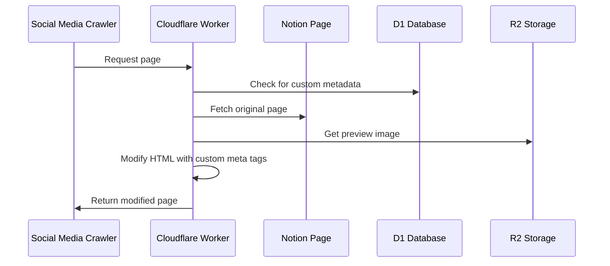
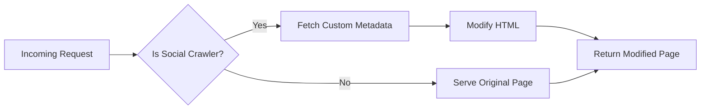
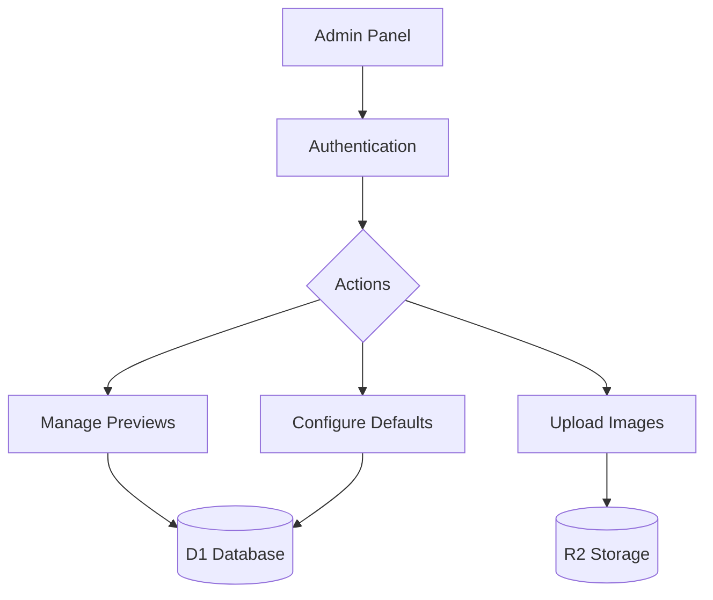
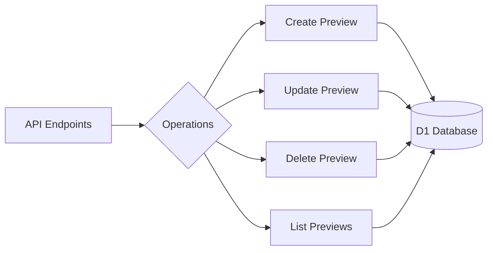
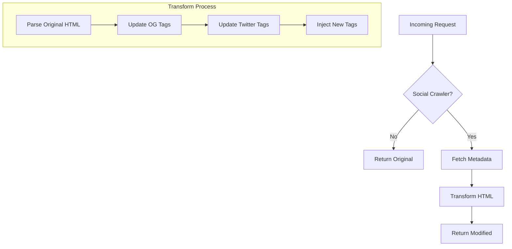
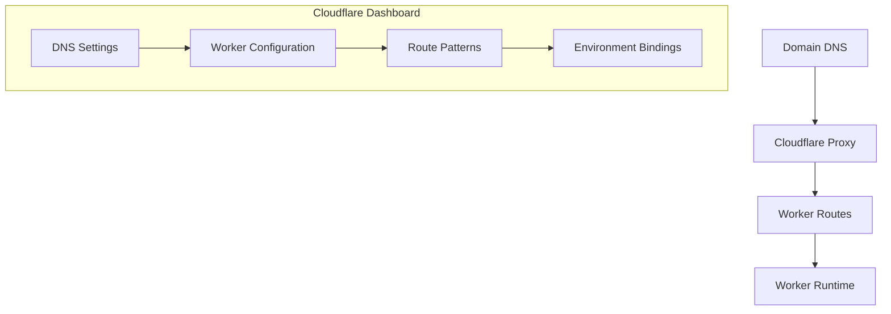
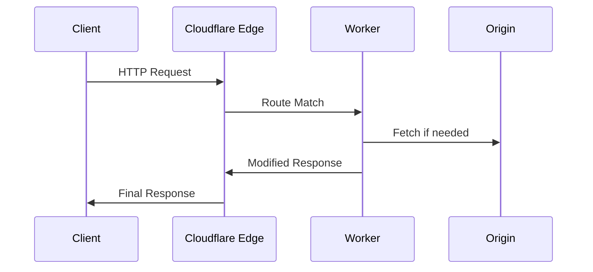
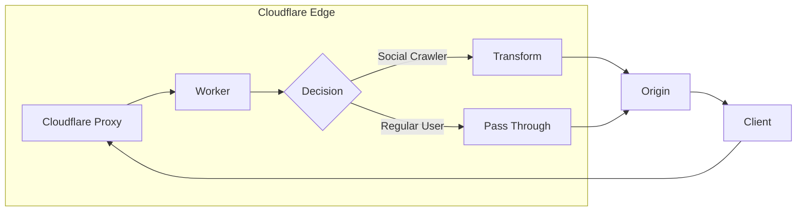
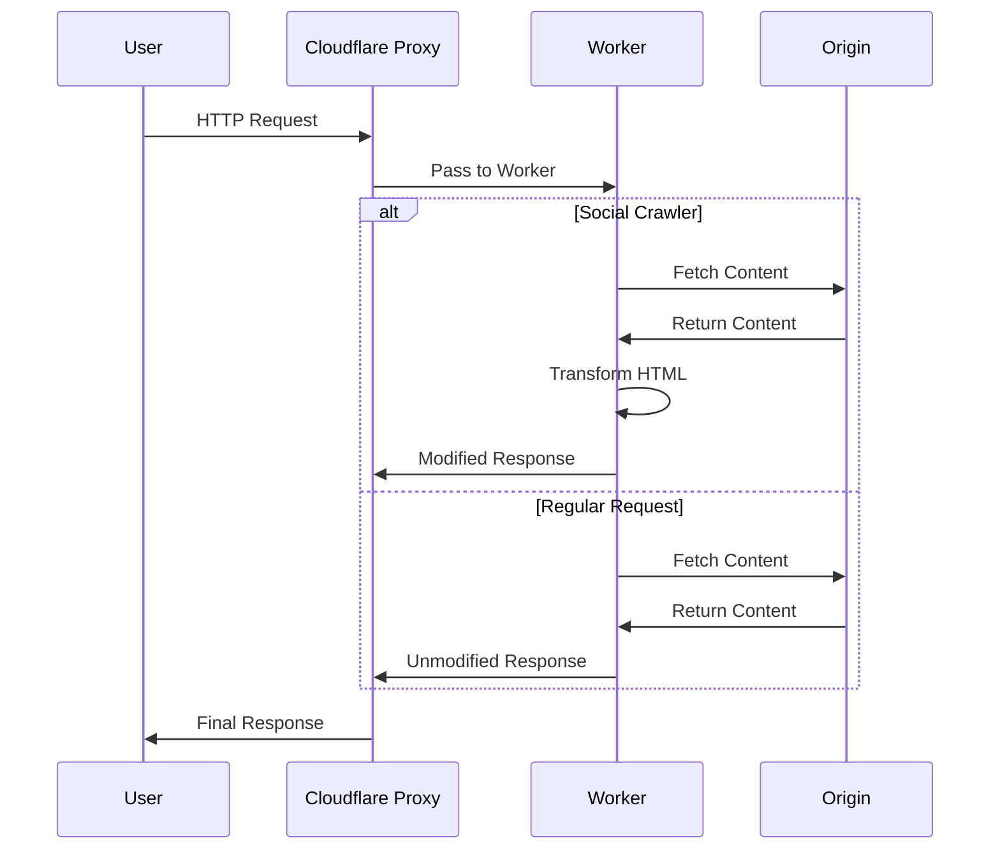

# `sharecraft`

A Cloudflare Worker that customizes social media preview cards for Notion pages. This worker intercepts requests from social media crawlers and serves custom meta tags for better social sharing previews.

## `.plan`

- Involve `chanfana` in the project if helpful.

## Table of Contents

1. [Introduction & Features](#introduction--features)
2. [Getting Started](#getting-started)
3. [Architecture & Implementation Details](#architecture--implementation-details)
4. [Administration & Usage](#administration--usage)
5. [Technical Documentation](#technical-documentation)
6. [Troubleshooting & Maintenance](#troubleshooting--maintenance)
7. [Advanced Configuration](#advanced-configuration)
8. [Reference](#reference)

## Introduction & Features

### Core Features

- Custom social preview metadata for specific pages
- Default fallback previews
- Admin panel for managing previews
- Support for multiple social platforms (X, Facebook, LinkedIn, etc.)
- Image upload and management
- Secure authentication
- Detects social media crawlers
- Modifies HTML responses to include custom metadata
- Serves images from R2
- Provides an admin interface

### Key Benefits

- **Customized Social Sharing**: Full control over how your content appears when shared on social platforms
- **Easy Management**: User-friendly admin interface for non-technical users
- **Optimized Performance**: Leverages Cloudflare's edge network with proper caching
- **Cost-Effective**: Uses Cloudflare's generous free tier for most small to medium blogs

### Storage Solutions

- **D1 Database**: Stores your custom social preview metadata
- **R2 Bucket**: Hosts your preview images
- **KV Namespace**: Manages configuration and admin authentication

## Getting Started

### Prerequisites

This solution uses:

- **Cloudflare Workers**: To intercept requests and modify HTML responses
- **Cloudflare D1**: SQL database to store custom preview metadata
- **Cloudflare R2**: Object storage for preview images
- **Cloudflare KV**: To store configuration and session data

### Setup Instructions

#### 1. Set Up Cloudflare Resources

First, install the Wrangler CLI:

```bash
bun install
```

Then login to your Cloudflare account:

```bash
bun x wrangler login
```

##### Create D1 Database

```bash
bun x wrangler d1 create social_previews
```

Take note of the database ID from the output.

##### Create R2 Bucket

```bash
bun x wrangler r2 bucket create preview-images
```

##### Create KV Namespace

```bash
bun x wrangler kv:namespace create CONFIG
```

Take note of the namespace ID from the output.

#### 2. Configure wrangler.toml

Create a `wrangler.jsonc` file in your project root:

```jsonc
{
  "$schema": "node_modules/wrangler/config-schema.json",
  "name": "sharecraft",
  "main": "src/index.ts",
  "compatibility_date": "2025-04-28",
  "d1_databases": [
    {
      "binding": "D1_PREVIEWS",
      "database_name": "sharecraft-data-previews",
      "database_id": "sharecraft-data"
    }
  ],
  "r2_buckets": [
    {
      "binding": "R2_IMAGES",
      "bucket_name": "sharecraft-images"
    }
  ],
  "kv_namespaces": [
    {
      "binding": "KV_CONFIG",
      "id": "sharecraft-config"
    }
  ],
  "observability": {
    "enabled": true
  }
}
```

Replace the database_id with your actual D1 database ID if different.

#### 3. Initialize the Database

Create a `migrations` directory and save the SQL migration script there:

```bash
mkdir migrations
```

Put the D1 migration script in `migrations/init.sql`.

Run the migration:

```bash
bun x wrangler d1 execute sharecraft-data-previews --file=./migrations/init.sql
```

The following SQL schema will be used:

```sql
CREATE TABLE social_previews (
  id INTEGER PRIMARY KEY AUTOINCREMENT,
  path TEXT NOT NULL,
  title TEXT NOT NULL,
  description TEXT NOT NULL,
  image_url TEXT NOT NULL,
  is_default INTEGER DEFAULT 0
);
```

#### 4. Set Up KV Values

Set the admin username:

```sh
bun x wrangler kv:key put --binding=KV_CONFIG "admin_username" "admin" --namespace-id=sharecraft-config
```

Set the admin password using Cloudflare Secret. You can generate a secure password using the following code:

```javascript
function generateSecurePassword(length = 32) {
  const charset = "!#%*+,-.=@_~0123456789ABCDEFGHIJKLMNOPQRSTUVWXYZabcdefghijklmnopqrstuvwxyz"
  let password = ""
  for (let i = 0; i < length; i++) {
    const randomIndex = Math.floor(Math.random() * charset.length)
    password += charset[randomIndex]
  }
  return password
}
console.log(generateSecurePassword(32))
```

On macOS, you can copy the code to your clipboard, and simply run:

```sh
pbpaste | bun -
```

Then, set it as a secret.

```sh
bun x wrangler secret put SC_SHARECRAFT_ADMIN
```

Set your site domain:

```sh
bun x wrangler kv:key put --binding=KV_CONFIG "site_domain" "yourdomain.com" --namespace-id=sharecraft-config
```

#### 5. Create Worker Code

Create a `src` directory and put the worker code there:

```bash
mkdir src
```

Put the main worker code from the `worker-complete` artifact in `src/index.js`.

#### 6. Deploy the Worker

Deploy the worker to Cloudflare:

```bash
bun x wrangler deploy
```

#### 7. Configure DNS and Routes

Ensure your domain is using Cloudflare DNS, and that the worker route is correctly set to intercept all traffic to your domain.

## Architecture & Implementation Details

### High-Level Overview

Sharecraft is a Cloudflare Worker that enhances social media sharing for Notion pages by intercepting requests from social media crawlers and serving custom meta tags. Here's a high-level flow of how it works:



### Core Components

1. **Request Router**

- Routes requests based on path (/admin, /api, /images, or page requests)
- Handles different types of requests with specialized handlers
- Provides error handling and response formatting

2. **Page Handler**



- Detects social media crawlers
- Fetches custom metadata from D1
- Modifies HTML to include custom meta tags
- Handles fallback to default previews

3. **Admin Interface**



- Secure authentication using KV storage
- CRUD operations for preview metadata
- Image upload and management
- Default preview configuration

4. **Image Handler**

- Serves preview images from R2 storage
- Handles image optimization and caching
- Manages image access control

5. **API Layer**



- RESTful API for preview management
- Database operations using D1
- Input validation and error handling
- Secure endpoint access

### Data Storage

1. **D1 Database**

The worker uses a D1 database with the binding `D1_PREVIEWS` to store preview metadata:

- Page paths
- Custom titles
- Descriptions
- Image URLs
- Default settings
- Handles relationships and queries

2. **R2 Storage**

- Uses an R2 bucket with the binding `R2_IMAGES` to store preview images
- Provides fast edge access
- Handles image versioning

3. **KV Namespace**

- Uses a KV namespace with the binding `KV_CONFIG` to store configuration:
  - Admin credentials
  - Site settings
  - Session data
- Fast key-value access

### Security Features

1. **Authentication**

- Secure admin access
- Session management
- Role-based permissions

2. **Request Validation**

- Input sanitisation
- CORS policies
- Rate limiting

3. **Error Handling**

- Graceful error recovery
- Detailed error logging
- User-friendly error messages

### Performance Optimizations

1. **Edge Computing**

- Cloudflare Workers for fast response
- Global distribution
- Low latency access

2. **Caching**

- Browser caching headers
- R2 object caching
- KV data caching

3. **Resource Optimization**

- Efficient HTML modification
- Optimized database queries
- Minimal processing overhead

## Administration & Usage

### Admin Interface

A web-based dashboard that allows you to:

- Create and manage custom social previews for specific blog posts
- Upload custom preview images to R2
- Set a default social preview for posts without specific configurations

### Using the Admin Panel

1. Access the admin panel at: `https://yourdomain.com/admin/login`
2. Log in with the credentials you set in KV
3. You can now:

- Add new social preview configurations for specific blog posts
- Set up a default social preview for pages without specific configurations
- Upload custom preview images to R2

## Technical Documentation

### HTML Response Modification

The worker uses Cloudflare's powerful edge computing capabilities to modify HTML responses in real-time. Here's how it works:



#### Response Interception

1. **Request Analysis**

```typescript
const userAgent = request.headers.get("User-Agent") || ""
const isSocialCrawler = checkForSocialCrawler(userAgent)
```

- Intercepts incoming requests using Cloudflare Workers
- Checks User-Agent header for social media crawlers
- Supports multiple platforms (Facebook, Twitter, LinkedIn, etc.)

2. **Original Response Handling**

```typescript
const originalResponse = await fetch(request)
const originalText = await originalResponse.text()
```

- Uses Cloudflare's `fetch` API to get the original page
- Maintains original headers and response structure
- Streams response for efficient processing

3. **Metadata Integration**

```typescript
const metadata = await getMetadataForPage(path, env.D1_PREVIEWS)
const modifiedHtml = replaceMetaTags(originalText, metadata)
```

- Fetches custom metadata from D1 database
- Integrates with R2 for image URLs
- Handles fallback to default metadata

#### HTML Transformation

1. **Open Graph Tags**

```html
<meta property="og:title" content="Custom Title" />
<meta property="og:description" content="Custom Description" />
<meta property="og:image" content="https://your-domain.com/images/custom.jpg" />
```

- Replaces or adds Facebook/LinkedIn preview metadata
- Supports all standard Open Graph properties
- Maintains compatibility with existing tags

2. **Twitter Card Tags**

```html
<meta name="twitter:card" content="summary_large_image" />
<meta name="twitter:title" content="Custom Title" />
<meta name="twitter:description" content="Custom Description" />
<meta name="twitter:image" content="https://your-domain.com/images/custom.jpg" />
```

- Adds Twitter-specific card metadata
- Supports different card types
- Ensures proper image sizing

3. **Performance Optimizations**

- Uses regex-based replacement for speed
- Maintains HTML structure integrity
- Preserves original document encoding

#### Edge Processing

1. **Cloudflare Features Used**

- **HTMLRewriter**: For complex DOM manipulations
- **Cache API**: For response caching
- **Streaming**: For efficient response handling

2. **Error Handling**

```typescript
try {
  // Transformation logic
} catch (error) {
  console.error("Error handling page request:", error)
  return originalResponse
}
```

- Graceful fallback to original response
- Detailed error logging
- Zero downtime guarantee

3. **Headers Management**

```typescript
return new Response(modifiedHtml, {
  headers: originalResponse.headers
})
```

- Preserves original response headers
- Sets appropriate cache headers
- Maintains content-type consistency

## Troubleshooting & Maintenance

### Known Issues and Solutions

#### Build Loop Issue

**Problem**: When running `bun run build`, the build process enters an infinite loop. This occurs due to a circular reference between the build script and Wrangler's configuration.

**Cause**:

1. The build script (`scripts/build.ts`) calls `bun run wrangler build`
2. Wrangler's configuration in `wrangler.json` contains a `build` property that runs `bun run build`
3. This creates a circular dependency that leads to an infinite build loop

**Solution**:

1. Remove the `build` property from `wrangler.json` to break the circular reference
2. OR modify the build script to use a different command like `wrangler deploy --dry-run --outdir=dist --no-bundle` instead of `wrangler build`

**Fixed build script**:

```typescript
import { $ } from "bun"

async function runBuild() {
  try {
    console.log("🏗️  Bundling templates...")
    await $`bun run bundle`

    console.log("📦 Building worker...")
    // Changed from 'bun run wrangler build' to avoid the infinite loop
    await $`bun run wrangler deploy --dry-run --outdir=dist --no-bundle`

    console.log("✅ Build completed successfully!")
  } catch (error) {
    console.error("❌ Build failed:", error instanceof Error ? error.message : error)
    process.exit(1)
  }
}

// Handle cleanup on interruption
process.on("SIGINT", () => {
  console.log("\n🛑 Build interrupted, cleaning up...")
  process.exit(0)
})

await runBuild()
```

### Troubleshooting

#### Preview Not Showing Up

1. Use social network debug tools to test:

- [Facebook Sharing Debugger](https://developers.facebook.com/tools/debug/)
- [LinkedIn Post Inspector](https://www.linkedin.com/post-inspector/)

2. Check the worker logs for errors:

```bash
bun x wrangler tail
```

3. Verify that the path in your configuration matches exactly with your blog's URL path.

#### Admin Panel Access Issues

If you can't log in to the admin panel:

1. Reset your admin credentials in KV
2. Clear browser cookies
3. Try accessing from an incognito/private window

#### Image Upload Problems

1. Check that your R2 bucket is correctly configured
2. Verify the permissions on your R2 bucket
3. Check maximum upload size limitations

### Maintenance Tasks

#### Backing Up Data

Periodically back up your D1 database:

```bash
bun x wrangler d1 backup sharecraft-data-previews ./backup.sql
```

#### Monitoring Usage

Monitor your Cloudflare usage to avoid unexpected bills:

- Check R2 storage usage
- Monitor Worker requests
- Watch KV operations

## Advanced Configuration

### Cloudflare Integration Configuration

This section details how to configure Cloudflare to properly integrate the worker into the HTTP request/response cycle.



#### 1. Domain Configuration

1. **DNS Setup**

```plaintext
Type    Name               Content            Proxy Status
A       your-domain.com    203.0.113.1       Proxied
CNAME   www               your-domain.com    Proxied
```

- Add your domain to Cloudflare
- Ensure orange cloud (proxy) is enabled
- Update nameservers at your registrar

2. **SSL/TLS Configuration**

- Set SSL/TLS encryption mode to "Full" or "Full (Strict)"
- Enable "Always Use HTTPS"
- Optional: Configure custom certificates

#### 2. Worker Routes

1. **Route Patterns**

```toml
# In wrangler.toml
[routes]
pattern = "your-domain.com/*"   # Catch all routes
zone_name = "your-domain.com"
```

Alternative patterns:

```plaintext
your-domain.com/blog/*         # Only blog paths
your-domain.com/docs/*         # Only documentation
*.your-domain.com/*           # Include all subdomains
```

2. **Custom Domains**

```bash
# Add custom domain to worker
bun x wrangler publish --config wrangler.toml
bun x wrangler domains add your-domain.com
```

#### 3. Environment Setup

1. **Worker Bindings**

```jsonc
// In wrangler.jsonc
"d1_databases": [
  {
    "binding": "D1_PREVIEWS",
    "database_name": "sharecraft-data-previews",
    "database_id": "sharecraft-data"
  }
],
"r2_buckets": [
  {
    "binding": "R2_IMAGES",
    "bucket_name": "sharecraft-images"
  }
],
"kv_namespaces": [
  {
    "binding": "KV_CONFIG",
    "id": "sharecraft-config"
  }
]
```

2. **Environment Variables**

```bash
# Set required environment variables
bun x wrangler secret put SITE_DOMAIN
bun x wrangler secret put ADMIN_EMAIL
```

#### 4. Traffic Management

1. **Request Processing**



2. **Cache Configuration**

- Set cache rules in Cloudflare dashboard
- Configure worker-specific caching
- Define cache bypass rules

#### 5. Deployment

1. **Production Deployment**

```bash
# Deploy to production
bun x wrangler deploy

# Verify routes
bun x wrangler tail
```

2. **Testing Configuration**

```bash
# Test worker locally
bun x wrangler dev

# Test with custom domain
bun x wrangler dev --local-protocol https
```

#### 6. Monitoring Integration

1. **Analytics Setup**

- Enable Worker Analytics in dashboard
- Configure error logging
- Set up request monitoring

2. **Health Checks**

```bash
# Monitor worker health
bun x wrangler tail --format=json
```

#### 7. Security Configuration

1. **Access Rules**

- Configure Firewall Rules
- Set up API Shield
- Enable Bot Management

2. **Rate Limiting**

```toml
# In wrangler.toml
[limits]
requests_per_minute = 100
```

#### 8. Troubleshooting Routes

Common issues and solutions:

1. **Worker Not Triggering**

- Verify route patterns match your domain
- Check proxy status (orange cloud) is enabled
- Confirm worker is deployed successfully

2. **Route Conflicts**

- Review route priority
- Check for overlapping patterns
- Verify zone ID matches domain

3. **SSL Issues**

- Validate SSL/TLS mode
- Check certificate status
- Verify HTTPS redirect settings

### Using Cloudflare Secrets for Password Storage

To enhance security, the application uses Cloudflare Secrets to store sensitive information like the admin password instead of KV storage. Here's how it was implemented:

#### 1. Environment Type Updates

The `Env` interface in `src/types.ts` was updated to include the secret:

```typescript
export interface Env {
  DB: D1Database
  PREVIEW_IMAGES: R2Bucket
  CONFIG: KVNamespace
  SC_SHARECRAFT_ADMIN: string // Cloudflare Secret for admin password
}
```

#### 2. Authentication Logic Changes

The authentication logic in `src/utils/auth.ts` was modified to use the secret for password verification:

```typescript
// Before: Password from KV
const storedPassword = await env.KV_CONFIG.get("admin_password")

// After: Password from Secret
const storedPassword = env.SC_SHARECRAFT_ADMIN
```

#### 3. Setting Up the Secret

Unlike KV values, Cloudflare Secrets don't need to be defined in the `wrangler.jsonc` file. Instead, they're managed using the Wrangler CLI:

```sh
# Set the admin password secret
bun x wrangler secret put SC_SHARECRAFT_ADMIN
# When prompted, enter your secure password
```

#### 4. Benefits of Using Secrets

- **Enhanced Security**: Secrets are encrypted at rest and in transit
- **Access Control**: Secrets have more granular access controls than KV
- **Auditing**: Secret access can be monitored and audited
- **No Accidental Exposure**: Secrets aren't exposed in logs or error messages
- **Simpler Access**: Direct access via the environment variable without async calls

#### 5. Secret vs. KV Storage

| Feature    | Secrets                  | KV Storage                  |
| ---------- | ------------------------ | --------------------------- |
| Encryption | End-to-end encrypted     | Encrypted at rest           |
| Access     | Direct via env variables | Requires async API calls    |
| Cost       | Free                     | Storage limits apply        |
| Size limit | 1KB per secret           | 25MB per value              |
| Visibility | Never exposed in logs    | Can appear in logs          |
| Use case   | Credentials, API keys    | Configuration, session data |

By moving the admin password to Cloudflare Secrets, we've improved the security posture of the application while keeping non-sensitive configuration in KV for easy access and updates.

### Worker's Role in Request Chain

The Worker functions as a selective proxy with transformation capabilities. Here's how it fits in the request chain:



#### Proxy Behavior

1. **Selective Modification**

- The Worker is not a traditional proxy that modifies all traffic
- It only transforms responses for social media crawlers
- All other requests pass through with minimal overhead

2. **Request Flow**

```typescript
// Only fetch from origin when needed
const originalResponse = await fetch(request)

// Most requests pass straight through
if (!isSocialCrawler) {
  return originalResponse
}
```

3. **Key Differences from Traditional Proxies**

- **Selective Processing**: Only modifies specific requests (social crawlers)
- **Zero Copy**: Regular traffic flows through with minimal intervention
- **Edge Processing**: Runs at Cloudflare's edge, not a separate proxy server
- **Stateless Operation**: No connection pooling or persistent state

4. **Performance Impact**

- Regular requests: ~0-1ms additional latency
- Social crawler requests: ~5-10ms for transformation
- No connection overhead
- No additional DNS lookups

#### Integration with Cloudflare's Proxy

1. **Request Chain**



2. **Proxy Stack**

- Cloudflare's proxy handles:
  - SSL/TLS termination
  - DDoS protection
  - Caching
- Worker handles:
  - Request inspection
  - Content transformation
  - Response modification

3. **Benefits of This Architecture**

- Minimal latency impact
- No additional infrastructure
- Scales automatically
- Maintains origin connection security

This architecture means the Worker acts as a "smart filter" within Cloudflare's proxy infrastructure, rather than a traditional proxy server. It selectively transforms content only when needed, while allowing most traffic to flow through with minimal intervention.

## Reference

### Support

For issues with:

- Cloudflare Workers: [Cloudflare Workers documentation](https://developers.cloudflare.com/workers/)
- D1 Database: [D1 documentation](https://developers.cloudflare.com/d1/)
- R2 Storage: [R2 documentation](https://developers.cloudflare.com/r2/)
- KV: [KV documentation](https://developers.cloudflare.com/kv/)

## License

This project is licensed under the MIT License. See the [LICENSE](LICENSE) file for details.

## Integrating Chanfana for OpenAPI Support

[Chanfana](https://github.com/cloudflare/chanfana) is a TypeScript library developed by Cloudflare that enhances Workers by providing automatic OpenAPI 3.1 schema generation and request validation. It's built to work with [Hono](https://github.com/honojs/hono), a lightweight web framework for edge environments.

### What Chanfana Does

- **Automatic OpenAPI Documentation**: Generates OpenAPI 3.1 specs directly from your code
- **Request Validation**: Validates incoming requests against your defined schemas
- **Type Safety**: Uses Zod for type validation and schema definition
- **Integration with Hono**: Seamlessly works with the Hono framework used by your Worker

### Benefits for Sharecraft

1. **API Documentation**: Automatically generate OpenAPI documentation for your admin endpoints
2. **Input Validation**: Validate request bodies and parameters to prevent errors
3. **Developer Experience**: Improved type safety and code organization
4. **Client Generation**: Generate API clients from your OpenAPI specs

### Integration Steps

1. **Install Dependencies**:

   ```bash
   bun add chanfana hono zod
   ```

2. **Create an API Router**:
   Create a new router file (e.g., `src/api.ts`):

   ```typescript
   import { fromHono } from "chanfana"
   import { Hono } from "hono"
   import { PreviewCreate } from "./endpoints/previewCreate"
   import { PreviewList } from "./endpoints/previewList"
   import { PreviewDelete } from "./endpoints/previewDelete"
   // Import more endpoints as needed

   // Create a Hono app for API routes
   const app = new Hono<{ Bindings: Env }>()

   // Setup OpenAPI registry
   const openapi = fromHono(app, {
     docs_url: "/api/docs",
     title: "Sharecraft API",
     version: "1.0.0",
     description: "API for managing Notion social preview cards"
   })

   // Register OpenAPI endpoints
   openapi.get("/api/previews", PreviewList)
   openapi.post("/api/previews", PreviewCreate)
   openapi.delete("/api/previews/:previewId", PreviewDelete)
   // Add more routes as needed

   export default app
   ```

3. **Create Endpoint Definitions**:
   For each endpoint, create a file in `/src/endpoints/` folder:

   Example for `PreviewList.ts`:

   ```typescript
   import { Bool, Num, OpenAPIRoute } from "chanfana"
   import { z } from "zod"
   import { type AppContext, Preview } from "../types"

   export class PreviewList extends OpenAPIRoute {
     schema = {
       tags: ["Previews"],
       summary: "List Social Previews",
       request: {
         query: z.object({
           page: Num({
             description: "Page number",
             default: 0
           })
         })
       },
       responses: {
         "200": {
           description: "Returns a list of social previews",
           content: {
             "application/json": {
               schema: z.object({
                 success: Bool(),
                 previews: Preview.array()
               })
             }
           }
         }
       }
     }

     async handle(c: AppContext) {
       // Implementation to list previews from D1
       const data = await this.getValidatedData<typeof this.schema>()
       const { page } = data.query

       // Your implementation here
     }
   }
   ```

4. **Define Types**:
   Create a `types.ts` file:

   ```typescript
   import { z } from "zod"
   import { Context } from "hono"

   export const Preview = z.object({
     id: z.number().optional(),
     path: z.string(),
     title: z.string(),
     description: z.string(),
     image_url: z.string(),
     is_default: z.boolean().default(false)
   })

   export type Preview = z.infer<typeof Preview>
   export type AppContext = Context<{ Bindings: Env }>
   ```

5. **Integrate with Main Worker**:
   Update your main worker file to include the API router:

   ```typescript
   import apiRouter from "./api"

   // In your worker setup
   app.route("/", apiRouter)
   ```

6. **Access the Documentation**:
   Once deployed, you can access your API documentation at `/api/docs`.

### Example Files Structure

```
src/
├── index.ts           # Main worker entry point
├── api.ts             # API router setup with chanfana
├── types.ts           # Shared types and schemas
└── endpoints/
    ├── PreviewList.ts
    ├── PreviewCreate.ts
    └── PreviewDelete.ts
```

For more details, refer to the [Chanfana documentation](https://chanfana.pages.dev/) and [Hono documentation](https://hono.dev/docs).
